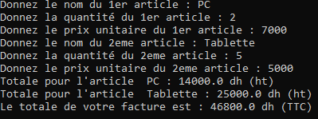
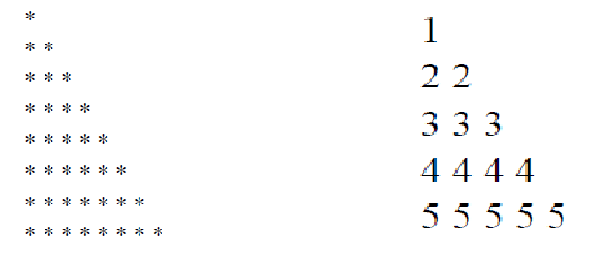
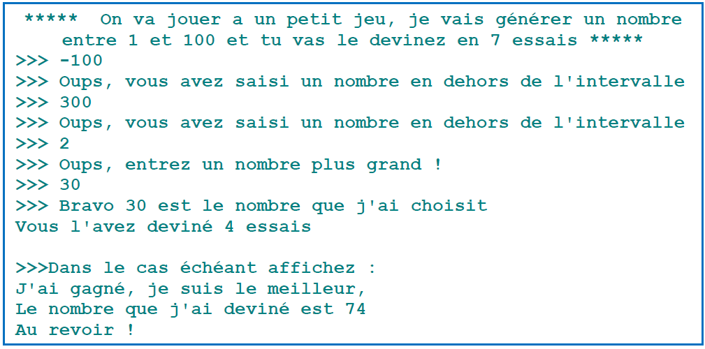

# PYTHON EXERCICES TP's


**PLAN :**
- [Série N°1](#serie-n1) 
- [Série N°2](#serie-n2) 


<a id="serie-n1"></a>  

## Série N°1

### Exercice 1

Ecrire, compiler et visualiser le résultat de ce programme
```python
  a=input("Saisir une valeur ") 
  b=a+1 
  print(b)
```

Interpréter/ corriger le résultat.

### Exercice 2
Ecrire un programme qui prend ==l’âge== et la taille de l’utilisateur et les affiches dans un message par exemple :  
**Vous avez 21 ans et vous mesurez 1.81 m.**

### Exercice 3
Ecrire un programme qui demande à l’utilisateur de saisir une distance (en kilomètre) et le temps (minute) nécessaire pour la parcourir ; votre programme doit calculer la vitesse (en mètre par seconde). Pour rappelle la vitesse= distance/temps

### Exercice 4
Ecrire un programme au quel on fournit un nombre de seconde et on le convertir en heure minute et seconde par exemple : 4510 secondes= 1h 15 min 10 sec

### Exercice 5
Ecrire un programme qui qui affiche en fonction d’une valeur saisie l’un des messages suivants :  
- ”Ce nombre est pair”
- ”Ce nombre est impair, mais est multiple de 3”
- ”Ce nombre n’est ni pair ni multiple de 3”


### Exercice 6
Ecrire un programme qui demande deux nombres à l’utilisateur et l’informe ensuite si leur produit est négatif ou positif. Attention toutefois : on ne doit pas calculer le produit des deux nombres.

### Exercice 7
Ecrire un programme qui permet à l’utilisateur de saisir deux nombre ainsi qu’une opération soi + pour l’addition, - pour la soustraction, * pour la multiplication, ou / pour la division. Le programme doit retourner le résultat adéquat à l’opération choisi

### Exercice 8
Ecrire un programme qui permet de saisir 4 notes au clavier, ainsi que leurs coefficients respectives, et affiche la moyenne de ces notes:  
- **note 1** : 12
- **coefficient** : 2
- **note 2** : 15.25
- **coefficient** : 1
- **note 3** : 13.5
- **coefficient** : 4
- **note 4** : 8.75
- **coefficient** : 3
- moyenne de ces 4 notes : 11.95, semestre validé  

Votre programme doit afficher aussi si le semestre est validé (la note >=10), rattrapage (10>note>=7) ou non
validé (note<7)

### Exercice 9
Ecrire un programme qui permet de saisir le nom, le prix et la quantité des articles qui constitue une facture.  
(Le nombre d’article est fixé à 2).  
Le programme doit calculer le totale de la facture. N’oublier pas d’ajouter la TVA pour chaque article (20%)
(MontantTTC=MontantHT + Montant HT*0.2). Votre programme doit afficher le montant totale de chaque
article ainsi que le totale.  
Exemple d’exécution :  


### Exercice 10
Ecrire un programme qui demande à l’utilisateur de saisir un login et un mot de passe (deux chaines de
caractères). Le programme doit tester si les deux chaines sont égales à « admin » « admin » si c’est le cas on affiche un message de bienvenue sinon on affiche un message à l’utilisateur lui informant que le login et le mot de passe saisie sont incorrecte.

### Exercice 11
Créer un programme qui calcule l’indice de masse corporelle (IMC) avec IMC=Pois/taille2
Afficher un message qui contient l’interprétation du résultat  

| IMC | Interprétation |
| --- | -------------- |
| + de 40 | obésité morbide ou massive |
| 35 à 40 | obésité sévère |
| 30 de 35 | obésité modérée |
| 25 de 30 | Surpoids |
| 18.5 de 25 | corpulence normale |
| 16.5 à 18.5 | Maigreur |
| - de 16.5 | Famine |

### Exercice 12
Ecrire un programme qui calcule le salaire des employées d’une société. L’utilisateur doit saisir le grade et le nombre d’heure qu’a travaillé l’employé le payement se fait à base de la grille tarifaire suivante :

| Grade | Traif horaire | Prime |
| ----- | ------------- | ----- |
| A | 200dh | 1000dh pour chaque 20 heures de travail |
| B | 150dh | 800dh pour chaque 20 heures de travail |
| C | 120dh | 500dh pour chaque 15 heures de travail |
| D | 100dh | 350dh pour chaque 15 heures de travail |
| E | 80dh | 100dh pour chaque 10 heures de travail |

___
<a id="serie-n2"></a>

## Série N°2

### Exercice 1
Ecrire un programme qui calcule la valeur de la somme : **a+aa+aaa+aaaa** pour un chiffre que
l’utilisateur saisi au clavier.  
Exemple si l’utilisateur saisi 9 le programme doit afficher **9+99+999+9999= 11106**

### Exercice 2
Écrire un programme qui affiche la suite de symboles suivante, la taille du triangle doit être saisi par
l’utilisateur:  



### Exercice 3
Ecrire un programme qui génère aléatoirement un entier entre **1 et 100** et à l'utilisateur de deviner ce
nombre en **7 essais**. Le programme vous signale si le nombre que l'utilisateur a saisi est **très grand**,
**très petit**, ou s'il a trouvé le bon nombre, ainsi que le nombre d’essai de l’utilisateur, l’interface du jeu est comme suit :  



### Exercice 4
Soit L une liste qui contient les nombres suivants : **{1,-30,0,-2,500,4,2,100}**, écrire un programme qui permet de créer une nouvelle liste M qui contient les nombres négatifs au début de la liste M et les nombres positifs à la fin de la liste M en gardant leurs ordres.

### Exercice 5
Écrire un programme Python qui permet d'insérer une valeur val dans une liste L triée.

### Exercice 6
Ecrire un programme qui supprime toutes les occurrences d’un nombre choisi par l’utilisateur

### Exercice 7
Ecrire un programme qui supprime tous les redoublants d’une liste L sans ajouter des listes supplémentaires.  
**L=[1,2,5,8,6,2,5,9,1,8,8]** devient **[1, 2, 5, 8, 6, 9]**

### Exercice 8
Ecrire un programme qui recherche un nombre saisi par l’utilisateur dans une liste. Votre programme doit retourner **le nombre d’occurrences** ainsi que **les indices** (position) de **chaque occurrence**.

### Exercice 9
Ecrire un programme qui permet de convertir plusieurs valeurs *« euro en dirham (mad) »* ou *l’inverse*.  
- Votre programme doit demander à l’utilisation de choisir la direction de la convention **« euro en mad »** ou **« mad en euro »**
- Ensuite l’utilisateur va saisir autant de valeur qu’il veut. La saisie va **s’arrêter** dès que l’utilisateur a saisi **un nombre négatif**.
- Finalement votre programme affiche les valeurs converties dans la monnaie souhaitée.

1 mad= 0.092 euro  
1 euro = 10.86 mad

### Exercice 10
Ecrire un programme qui calcule l’intersection de deux listes L1 et L2 qui la stocke dans une 3eme liste L3. Exemple :  
L1= [1,3,6,78,35,88,55]  
L2= [12,24,35,24,88,120,155]  
L3= [35,88]

### Exercice 11
Ecrire un programme qui fait une transformation miroir d’une liste  
Exemple la liste **L= [8, 24, 48, 2, 16]** le résultat attendu est : **[16, 2, 48, 24, 8]**